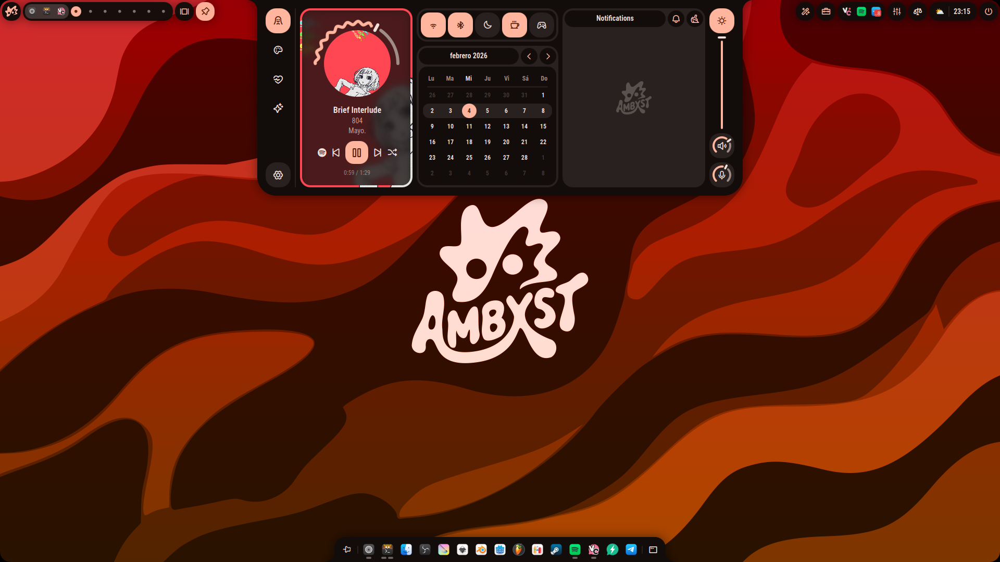
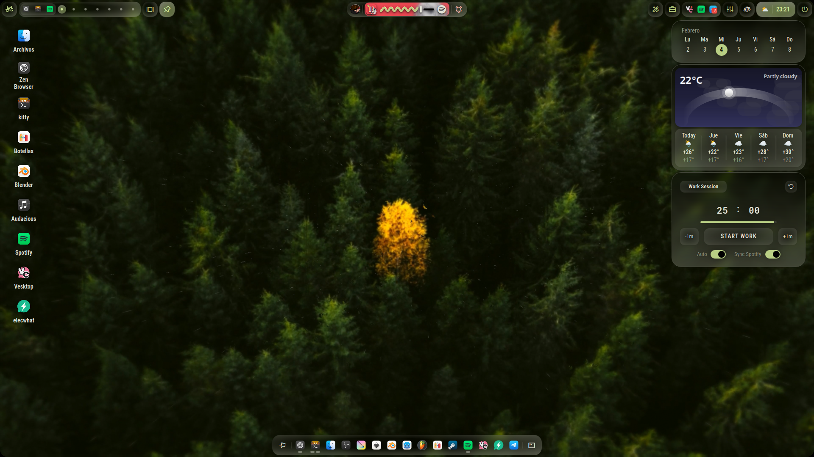
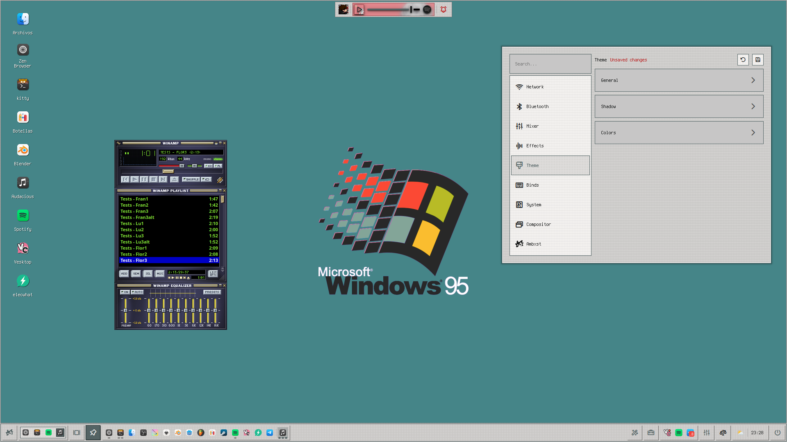
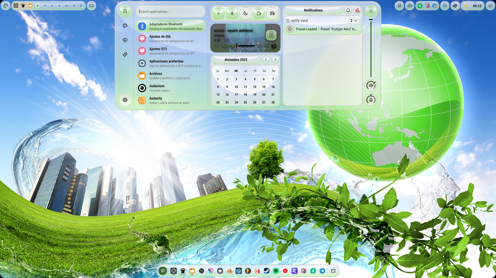
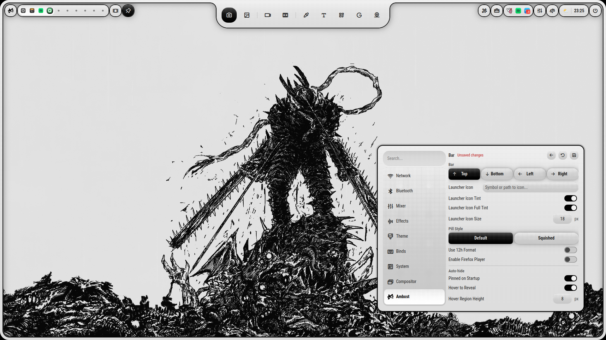
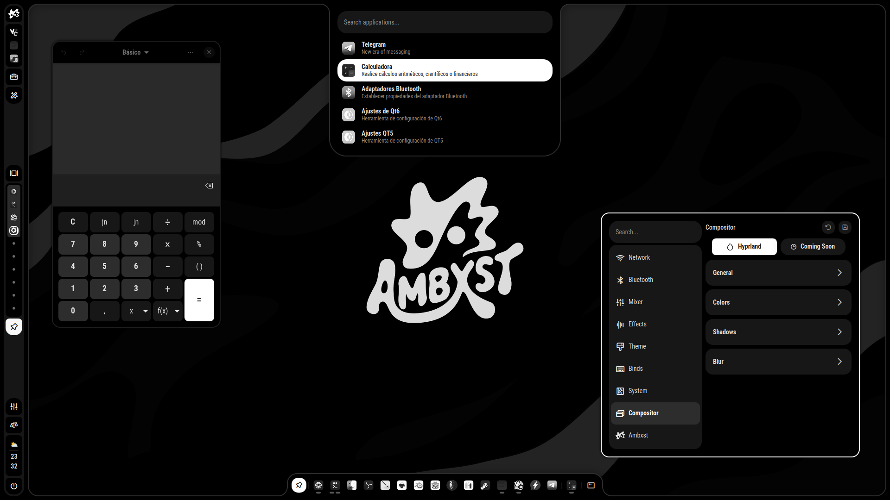
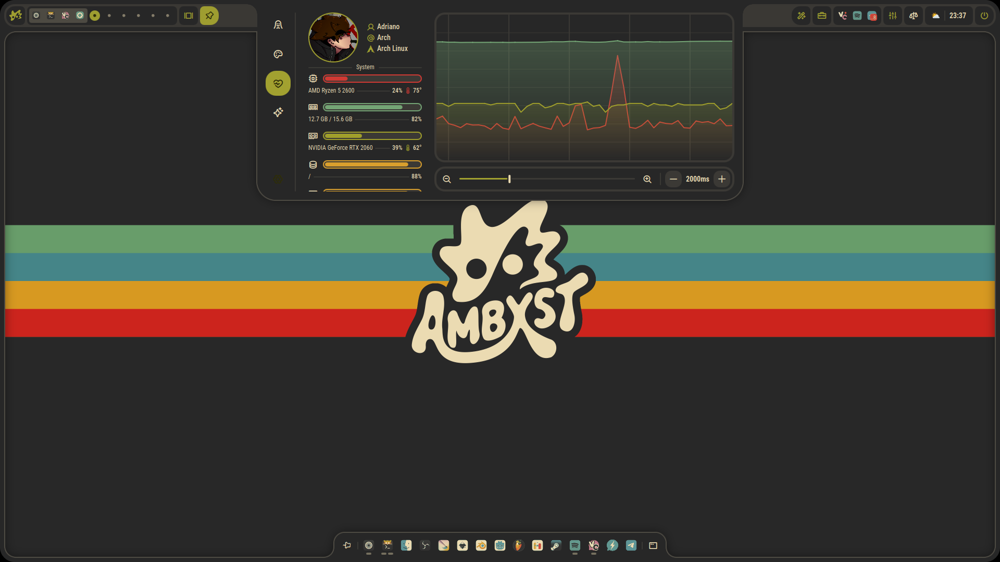
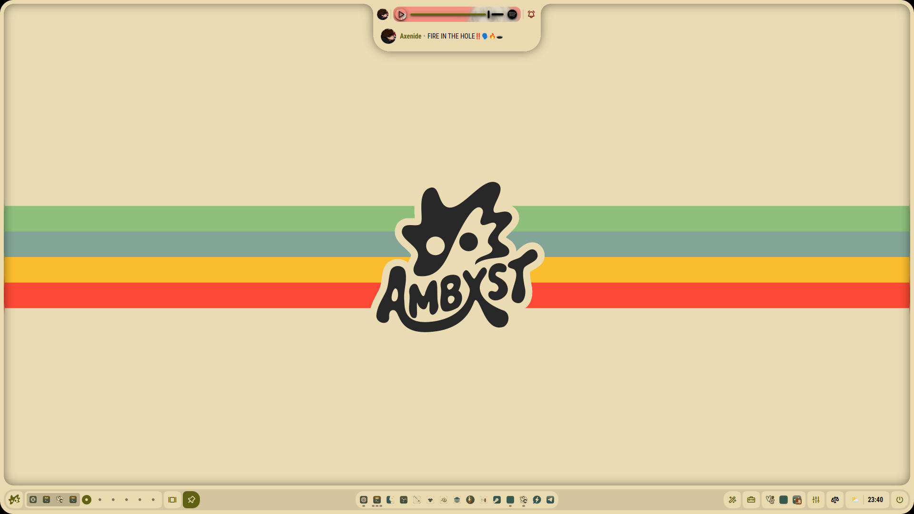
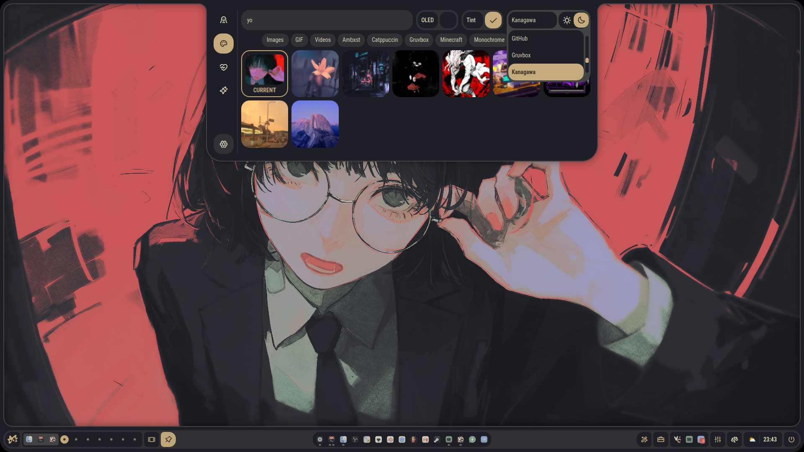

<p align="center">

  <br>
  <br>
An <i><b>Ax</b>tremely</i> customizable shell.
</p>

> [!NOTE]
> **This is a modified fork of the original Ambxst shell.**
> The original shell was created by [Axenide](https://github.com/Axenide/Ambxst). This personal version contains custom features, tweaks, and optimizations. If you wish to install this specific customized version, you should clone and install it directly from this repository:
> ```bash
> git clone https://github.com/cristiansrc/ambxst.git
> cd ambxst
> ./install.sh
> ```

### 🚀 Key Custom Features & Fixes in this Fork:
* **Google Calendar Integration**:
  * Real-time display of daily events inside the Notch dashboard.
  * KDE Plasma-style event indicators (dot counters) directly on calendar day buttons.
  * Detailed event viewer at the bottom of the widgets panel.
  * Automation script with Colombia holiday detection (automatically skips notifications on holidays).
* **Media Player Enhancements**:
  * Fixed window height clipping and rendering issues to keep player borders and rounded corners fully visible during playback.
  * Switched YouTube thumbnail resolution to `mqdefault.jpg` to eliminate black bars (letterbox padding) on video-derived artwork.
* **Layout and Dashboard Optimizations**:
  * Set the Notch dashboard height to `580px` (up from 344px) for a larger workspace in all tabs.
  * Aligned column heights cleanly using dynamic layout scaling (`Layout.fillHeight`).
  * Repositioned scrollbar to the left side and optimized spacing inside the calendar weeks grid.
* **Hardware Detection & Control Fallbacks**:
  * Added automatic verification to check if the computer has Bluetooth and/or Wi-Fi hardware. If not present, all related indicators, toggle switches, and services are cleanly disabled to prevent system overhead and logs clutter.
* **Multi-Monitor Settings Support**:
  * Fixed a bug in multi-monitor setups where the Settings Window would only open on the primary screen. The config panel now correctly launches and displays on whichever screen the settings gear button is clicked.

---

  <p align="center">
  <a href="https://github.com/Axenide/Ax-Shell/stargazers">
    
  </a>
  <a href="https://ko-fi.com/Axenide">
    
  </a>
  <a href="https://discord.com/invite/gHG9WHyNvH">
    
  </a>
</p>

---

<h2><sub></sub> Screenshots</h2>

<div align="center">
  

  <br />

  
  
  

  
  
  

  
  
  
</div>

---

<h2><sub></sub> Installation</h2>

```bash
curl -L get.axeni.de/ambxst | sh
```

This will install Ambxst and its dependencies. You will have the `ambxst` command available in your terminal, which you can use to start the shell.

### Hyprland (more compositors coming soon!)

1. Run the installation command above.

2. Run `ambxst install hyprland` to add Ambxst's configuration to Hyprland. This will source a config file that applies Ambxst's settings. If you use `hyprland.lua`, or if no Hyprland config exists yet, it will look like this:

```lua
-- Ambxst
loadfile(os.getenv("HOME") .. "/.local/share/ambxst/hyprland.lua")()

-- OVERRIDES
-- Down here you can write or source anything that you want to override from Ambxst's settings.
```

If you only have `hyprland.conf`, Ambxst will keep using the legacy import there for compatibility:

```bash
# Ambxst
source = ~/.local/share/ambxst/hyprland.conf

# OVERRIDES
# Down here you can write or source anything that you want to override from Ambxst's settings.
```

As stated, anything you want to override from Ambxst's settings should be written under the "OVERRIDES" section.

3. Start Ambxst by running `ambxst` in your terminal. If you want to keep it running without having the terminal window open, you can run `ambxst & disown`. This will be only necessary for your first test run, as Ambxst will start automatically on login after step 2.

Ambxst is currently supported on **Arch**, **Fedora**, and **NixOS**. This means both based and derivative distributions.

> [!IMPORTANT]
> The only pre-requisite is having Hyprland installed.

> [!NOTE]
> For NixOS users, the screen recording utility `gpu-screen-recorder` will only be able to use the `portal` backend until you add `programs.gpu-screen-recorder.enable = true;` to your `configuration.nix` or **home-manager**.

---

## Will this change my config?

Nope! Besides the Ambxst import block in your `hyprland.conf` or `hyprland.lua`, Ambxst is designed to be non-intrusive. It won't modify any of your existing configurations.

---

<h2><sub></sub> Features</h2>

- [x] Customizable components
- [x] Themes
- [x] System integration
- [x] App launcher
- [x] Clipboard manager
- [x] Quick notes (and not so quick ones)
- [x] Wallpaper manager
- [x] Emoji picker
- [x] [tmux](https://github.com/tmux/tmux) session manager
- [x] System monitor
- [x] Media control
- [x] Notification system
- [x] Wi-Fi manager
- [x] Bluetooth manager
- [x] Audio mixer
- [x] [EasyEffects](https://github.com/wwmm/easyeffects) integration
- [x] Screen capture
- [x] Screen recording
- [x] Color picker
- [x] OCR
- [x] QR and barcode scanner
- [x] "Mirror" (webcam)
- [x] Game mode
- [x] Night mode
- [x] Power profile manager
- [x] AI Assistant
- [x] Weather
- [x] Calendar
- [x] Power menu
- [x] Workspace management
- [x] Support for different layouts (dwindle, master, scrolling, etc.)
- [x] Multi-monitor support
- [x] Customizable keybindings
- [ ] Plugin and extension system
- [ ] Compatibility with other Wayland compositors

---

## I need help!

If you are having trouble or have any questions:
- You can ask anything on [Discord](https://discord.com/invite/gHG9WHyNvH) or in the [GitHub discussions](https://github.com/Axenide/Ambxst/discussions).
- You can open an issue on the [GitHub repository](https://github.com/Axenide/Ambxst/issues).
- The main configuration is located at `~/.config/ambxst`.

---

## Credits
- [outfoxxed](https://outfoxxed.me/) for creating Quickshell and great documentation!
- [end-4](https://github.com/end-4) for his awesome projects. I learned a lot from them! (And *yoinked* a lot of code, too. 😅)
- [soramane](https://github.com/soramanew) for helping me when I started with Quickshell. (You probably don't remember, but still, heh.)
- [tr1x_em](https://trix.is-a.dev/) for being a great friend and helping me find great tools. You rock!
- [Darsh](https://github.com/its-darsh) for not killing me when I left Fabric. u_u (Also for being a great friend and creating Fabric! Without Fabric, Ax-Shell wouldn't exist, so Ambxst wouldn't either. Thank you!)
- [Mario](https://github.com/mariokhz) for being a great friend and showing me Quickshell!
- [Samouly](https://samouly.is-a.dev/) for being Samouly. :3
- [Brys](https://github.com/brys0) for being his continuous support and for being a great friend!
- [Zen](https://github.com/wer-zen) for being a great friend and helping me when I started with Quickshell too!
- [kh](https://www.youtube.com/watch?v=dQw4w9WgXcQ) for being an awesome human being and listening to my delusions about Ambxst. :D
- And you, the user, for trying out Ambxst! You're awesome! 💖

(If I forgot someone, please let me know. 🙏)

---

## 📅 Google Calendar Integration & Reminders

This shell includes support for Google Calendar sync (for both visual events and desktop notifications), as well as colombian holidays check.

### 1. Installation & Authentication
1. Install `gcalcli` (Google Calendar CLI):
   ```bash
   pipx install gcalcli
   ```
2. Set up client secrets if needed, or run `gcalcli list` to authenticate via Google oauth2 in your browser.

### 2. Configure Holiday Checks & Automatic Reminders
To receive notifications and block them on holidays, set up the reminder script and systemd units:

1. **Create the script** `~/.local/bin/gcalcli-remind.sh`:
   ```bash
   #!/bin/bash
   export DBUS_SESSION_BUS_ADDRESS="unix:path=/run/user/$(id -u)/bus"
   export DISPLAY=:0
   TODAY=$(date +%Y-%m-%d)
   
   # Check Colombia holidays calendar to skip alerts on holidays
   IS_HOLIDAY=$(gcalcli --calendar "Festivos en Colombia" agenda "$TODAY" "$TODAY 11:59pm" --tsv 2>/dev/null | grep -c "^$TODAY")
   if [ "$IS_HOLIDAY" -gt 0 ]; then
       exit 0
   fi
   
   # Check for upcoming events in 15 mins
   gcalcli remind 15 'notify-send -u critical -t 20000 "Google Calendar" "%s"'
   ```
   Make it executable: `chmod +x ~/.local/bin/gcalcli-remind.sh`.

2. **Systemd User Service** (`~/.config/systemd/user/gcalcli-remind.service`):
   ```ini
   [Unit]
   Description=Google Calendar Event Notifier
   After=graphical-session.target

   [Service]
   Type=simple
   ExecStart=%h/.local/bin/gcalcli-remind.sh

   [Install]
   WantedBy=default.target
   ```

3. **Systemd User Timer** (`~/.config/systemd/user/gcalcli-remind.timer`):
   ```ini
   [Unit]
   Description=Run Google Calendar Event Notifier every 5 minutes

   [Timer]
   OnBootSec=2min
   OnUnitActiveSec=5min

   [Install]
   WantedBy=timers.target
   ```

4. **Enable the Service**:
   ```bash
   systemctl --user daemon-reload
   systemctl --user enable --now gcalcli-remind.timer
   ```

